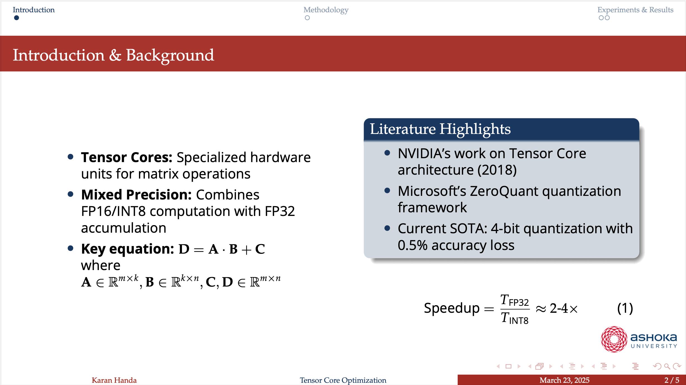

<p align="center">
  
</p>

# Ashoka University Beamer Template

LaTeX Beamer template for Ashoka University presentations.

## Preview




## Features

- Ashoka red and blue colors
- 16:9 aspect ratio
- Madrid theme with enhancements
- Ready-made slide layouts
- Styled title page, sections, blocks and typography

## Usage

1. Clone/download this repository
2. Edit `template.tex` with your content
3. Replace placeholders
4. Compile with LaTeX

## Setup

### Requirements

- LaTeX distribution:
  - Windows: [MiKTeX](https://miktex.org/download) or [TeX Live](https://tug.org/texlive/acquire-netinstall.html)
  - Mac: [MacTeX](https://tug.org/mactex/mactex-download.html)
  - Linux: `sudo apt install texlive-full`
- Editor (optional):
  - [TeXstudio](https://www.texstudio.org/)
  - [Overleaf](https://www.overleaf.com/)
  - [VS Code](https://code.visualstudio.com/) with LaTeX Workshop

### Compilation

Basic:
```bash
pdflatex template.tex
```

## Support

If you find this template useful, please consider giving it a ⭐ star on GitHub!

## License

This project is licensed under the MIT License - see the [LICENSE](LICENSE) file for details.

